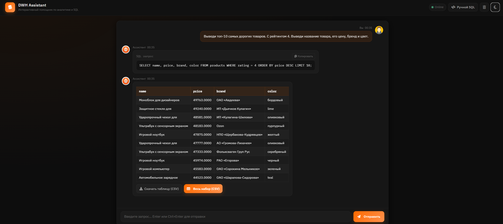

# DWH ASSISTANT

**DWH ASSISTANT** — это интеллектуальный сервис, который позволяет пользователям формулировать запросы к базе данных **естественным языком**. Сервис автоматически преобразует такие запросы в корректный SQL-код с помощью **YandexGPT**, выполняет его и возвращает результат.



Это решение упрощает работу аналитиков, менеджеров и других специалистов, которым нужны данные, но нет опыта в написании SQL.

---

## 🚀 Как запустить проект

### 1. Настройка окружения

Создайте файл `.env` в корневой папке проекта (`assistant/`) со следующими переменными:

```env
DEBUG_MODE=0
LLM_PROVIDER=YANDEX
CH_HOST=<your db host>
CH_USER=<your db user>
CH_PSW=<your db password>
YANDEX_API_KEY=<your yandex api-key>
YANDEX_FOLDER_ID=<your yandex folder id>
```

> Замените значения в угловых скобках на реальные данные вашей ClickHouse-базы и Yandex Cloud.

### 2. Установка и запуск

Выполните следующие команды в терминале **последовательно**:

```bash
make setup
source .venv/bin/activate
make run
```

> На Windows вместо `source .venv/bin/activate` используйте:
>
> ```cmd
> .venv\Scripts\activate
> ```

После этого сервис будет доступен локально (обычно по адресу `http://127.0.0.1:8000` — уточните в выводе терминала).

---

## 💡 Технологии

- **Языковая модель**: YandexGPT (через Yandex Cloud)
- **База данных**: ClickHouse
- **Backend**: Python (FastAPI / Flask — уточните по коду)
- **Управление зависимостями**: `make`, виртуальное окружение

---

## 📌 Важно

- Убедитесь, что у пользователя базы данных есть права на **чтение** нужных таблиц.
- Не коммитьте файл `.env` в Git — он уже должен быть в `.gitignore`.
- В режиме `DEBUG_MODE=1` могут включаться дополнительные логи (например, вывод сгенерированного SQL).
