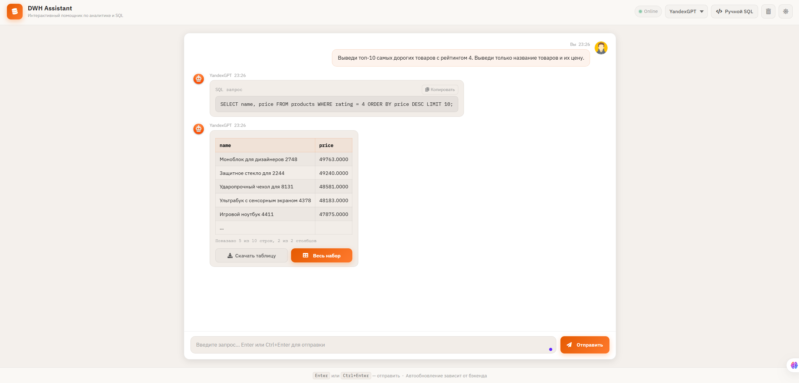

# DWH ASSISTANT

**DWH ASSISTANT** — это интеллектуальный сервис, который позволяет пользователям формулировать запросы к базе данных **естественным языком**. Сервис автоматически преобразует такие запросы в корректный SQL-код с помощью AI-моделей, выполняет его и возвращает результат.



Это решение упрощает работу аналитиков, менеджеров и других специалистов, которым нужны данные, но нет опыта в написании SQL.

## Возможности

- Преобразование вопросов на естественном языке в SQL-запросы
- Поддержка нескольких AI-моделей: **YandexGPT**, **ChatGPT (OpenAI)**, **Claude (Anthropic)** — с возможностью переключения прямо в интерфейсе
- Контекст диалога: сервис помнит последние 15 сообщений, что позволяет задавать уточняющие вопросы
- Ручной режим SQL — можно вводить и выполнять SQL-запросы напрямую
- Экспорт результатов в CSV
- Тёмная и светлая темы интерфейса

## Как запустить проект

### Вариант 1: Docker Compose (рекомендуется)

1. Создайте файл `.env` в корне проекта на основе шаблона `.env_sample` (в нём настраиваются и параметры базы данных, и API-ключи для AI-моделей).
2. Положите CSV-файлы с данными в папку `seed_data/`
   - Имена файлов должны совпадать с именами таблиц: `categories.csv`, `countries.csv`, `merchants.csv`, `users.csv`, `products.csv`, `orders.csv`, `order_items.csv`, `shipping_carriers.csv`
   - Заголовки CSV должны совпадать с названиями колонок таблиц
3. Запустите:

```bash
docker compose up --build
```

При первом запуске:
- Создастся БД PostgreSQL с нужной схемой
- CSV-файлы автоматически загрузятся в таблицы
- Приложение стартует после готовности БД

Сервис будет доступен по адресу `http://localhost:5001`.

> **Примечание:** Переменные подключения к БД (`PG_STUDENT_*`) автоматически переопределяются в `docker-compose.yml` для работы с контейнером PostgreSQL.

Для остановки:
```bash
docker compose down
```

Для полного сброса БД (пересоздание с загрузкой CSV):
```bash
docker compose down -v
docker compose up --build
```

### Вариант 2: Локальный запуск

#### 1. Настройка окружения

Создайте файл `.env` в корне проекта на основе шаблона `.env_sample` (или в папке `assistant/app/` для обратной совместимости). В нём необходимо указать:

- Параметры подключения к PostgreSQL
- API-ключи для используемых AI-провайдеров (достаточно настроить хотя бы один)
- Список таблиц для анализа

> Подробное описание всех переменных — в корневом файле `.env_sample`.

#### 2. Установка и запуск

```bash
make setup
.venv/Scripts/activate
make run
```

После этого сервис будет доступен по адресу `http://localhost:5001`.

## Структура проекта

```
dwh-assistant/
├── docker-compose.yml          # Оркестрация Docker-сервисов
├── db/
│   ├── init.sql                # SQL-схема (CREATE TABLE)
│   └── load_csv.sh             # Скрипт загрузки CSV при старте БД
├── seed_data/                  # CSV-файлы с данными таблиц
│   └── .gitkeep
└── assistant/
    ├── Dockerfile              # Docker-образ приложения
    ├── run.py                  # Точка входа (uvicorn)
    ├── Makefile                # Команды setup/run/lint/clean
    ├── requirements.txt        # Зависимости
    └── app/
        ├── __init__.py         # Инициализация приложения
        ├── app.py              # FastAPI-маршруты и логика
        ├── .env_sample         # Шаблон переменных окружения
        ├── services/
        │   ├── database.py     # Асинхронная работа с PostgreSQL (asyncpg)
        │   ├── llm.py          # Мульти-провайдерный LLM-сервис
        │   └── memory.py       # Контекст диалога (последние 15 сообщений)
        ├── templates/
        │   └── index.html      # SPA-интерфейс
        └── static/
            ├── user_avatar.png
            └── assistant_avatar.png
```

## Технологии

- **AI-модели**: YandexGPT, ChatGPT (OpenAI), Claude (Anthropic)
- **База данных**: PostgreSQL
- **Backend**: Python, FastAPI, uvicorn, asyncpg
- **Frontend**: HTML/CSS/JS (SPA, без фреймворков)
- **Управление зависимостями**: `make`, виртуальное окружение
